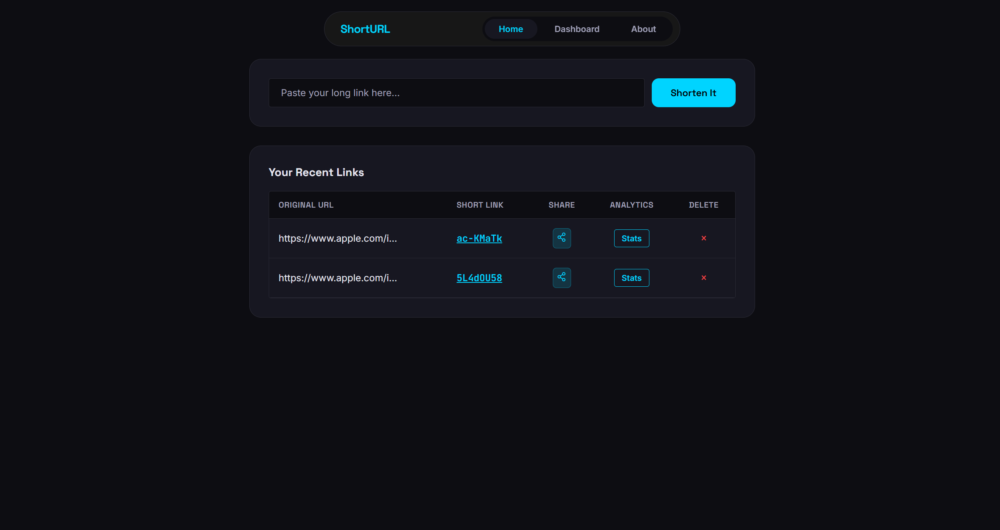
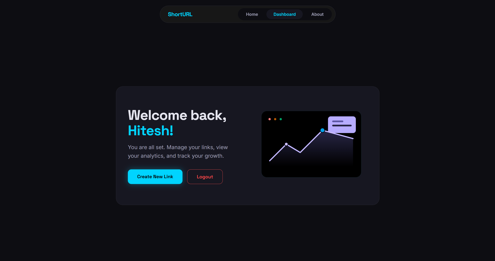
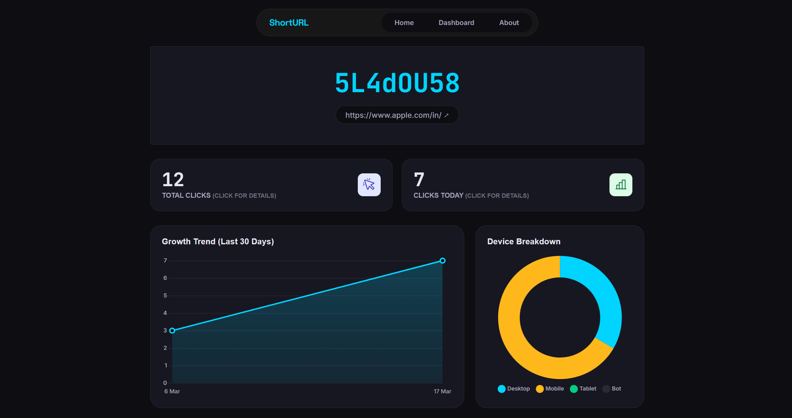
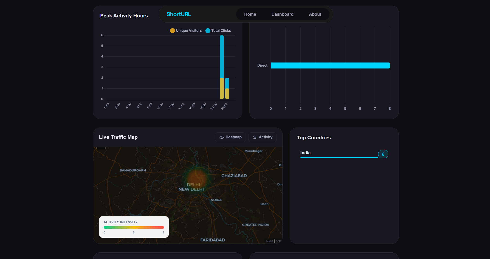
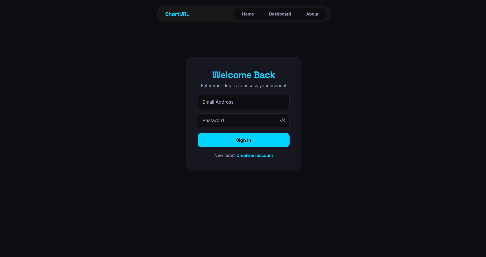

# 🔗 ShortURL - Premium Link Shortener


[](https://shorturl-ejvn.onrender.com/)

A modern URL shortener built with **Node.js**, **Express**, and **MongoDB**. Features a JWT-based authentication system, bcrypt password hashing, a glassmorphism dashboard, and real-time link analytics.

<p align="center">
  <a href="https://shorturl-ejvn.onrender.com/" target="_blank">
    
  </a>
</p>

---

## ✨ Features

### Core Functionality
- **URL Shortening:** Convert long URLs into short, shareable links with custom short IDs
- **JWT Authentication:** Stateless, scalable user sessions with secure cookie storage
- **Bcrypt Security:** Passwords are hashed with bcrypt for maximum security :lock:
- **Auto-Login:** Users are immediately authenticated upon successful registration
- **Link Management:** View all your shortened links in one dashboard with quick actions
- **Delete Links:** Remove unwanted links with one click


### Analytics & Tracking
- **Click Analytics:** Track total clicks, unique visitors, and visit history
- **Time-Based Insights:** Hourly breakdown charts and 30-day performance trends
- **Geographic Tracking:** Interactive heatmaps showing clicks by location (city, state, country)
- **Device Analytics:** Desktop, mobile, tablet, and bot detection
- **Referral Sources:** Track traffic from WhatsApp, Telegram, LinkedIn, Google, and more
- **OS Detection:** Detects and tracks the operating system of visitors for enhanced analytics

### Security
- **Bcrypt Password Hashing:** All user passwords are securely hashed using bcrypt.
- **JWT & Cookie Security:** Secure, stateless authentication with JWT. Sessions persist for 7 days using `httpOnly` cookies with environment-aware `secure` and `sameSite` settings.
- **Rate Limiting:** Request throttling on global traffic and auth endpoints to reduce abuse and brute-force attempts.
- **Secure Headers:** HTTP security headers enabled with Helmet.
- **Environment Variables:** Sensitive data is managed via environment variables.

### User Experience
- **Premium UI:** Floating pill-shaped navigation and glassmorphism cards with smooth transitions
- **Responsive Design:** Fully optimized for mobile, tablet, and desktop views
- **Social Sharing:** Direct share buttons for popular platforms with tracking parameters
- **Real-time Updates:** Live analytics and instant link generation
- **Password Visibility Toggle:** Eye icon on login and signup forms to show/hide password
- **Persistent Sessions:** Stay logged in for 7 days — works reliably on mobile browsers

---

## 🛠️ Tech Stack


### Backend
- **Node.js** - Runtime environment
- **Express.js** - Web framework
- **MongoDB** - Database
- **Mongoose** - ODM for MongoDB
- **JWT** - JSON Web Tokens for authentication
- **bcrypt** - Password hashing
- **Cookie-Parser** - Cookie handling
- **Helmet** - Security headers
- **Express Rate Limit** - Request throttling

### Frontend
- **EJS** - Embedded JavaScript Templates
- **CSS3** - Modern Flexbox/Grid with Glassmorphism effects
- **Chart.js** - Analytics charts
- **Leaflet.js** - Interactive maps
- **Phosphor Icons** - Icon library

### Utilities
- **NanoID** - Unique ID generation
- **Dotenv** - Environment variable management
- **IP Geolocation** - Location tracking ([ip-api.com](http://ip-api.com))
- **User Agent Parser** - Device detection

---

## 📁 Project Structure

```
url-shortener/
├── config/
│   ├── constants.js              # App constants and shared messages
│   └── index.js                  # Centralized environment/config loader
├── controllers/
│   ├── url.js                    # URL business logic
│   └── user.js                   # User business logic
├── middleware/
│   ├── auth.js                   # Authentication & authorization middleware
│   ├── errorHandler.js           # Global error handling
│   └── security.js               # Helmet + rate limit middleware
├── models/
│   ├── url.js                    # MongoDB schema for URLs
│   └── user.js                   # MongoDB schema for users
├── routes/
│   ├── staticRouter.js           # Static pages routes
│   ├── url.js                    # URL shortening routes
│   └── user.js                   # Authentication routes
├── service/
│   ├── analytics.js              # Visit tracking service
│   └── auth.js                   # JWT service functions
├── utils/
│   ├── analytics.js              # User-agent and source helpers
│   ├── errors.js                 # Error utility helpers
│   ├── formatters.js             # Data formatting helpers
│   ├── geolocation.js            # IP + geo helpers
│   └── locationMap.js            # State/country mapping data
├── public/
│   ├── css/
│   │   ├── about.css
│   │   ├── analytics.css
│   │   ├── auth.css
│   │   ├── base.css
│   │   ├── common.css
│   │   ├── components.css
│   │   ├── dashboard.css
│   │   ├── home.css
│   │   ├── login.css
│   │   ├── navbar.css
│   │   ├── signup.css
│   │   └── variables.css
│   └── js/
│       ├── about.js
│       ├── analytics-charts.js
│       ├── analytics-geo.js
│       ├── analytics-main.js
│       ├── analytics-map.js
│       ├── analytics-modals.js
│       └── home-modals.js
├── views/
│   ├── partials/
│   │   ├── analytics/
│   │   │   ├── activity-table.ejs
│   │   │   ├── chart-card.ejs
│   │   │   ├── geo-list.ejs
│   │   │   ├── header.ejs
│   │   │   ├── map-section.ejs
│   │   │   ├── modals.ejs
│   │   │   └── stat-card.ejs
│   │   └── navbar.ejs
│   ├── about.ejs
│   ├── analytics.ejs
│   ├── dashboard.ejs
│   ├── home.ejs
│   ├── login.ejs
│   └── signup.ejs
├── screenshots/
│   ├── analytics1.png
│   ├── analytics2.png
│   ├── dashboard.png
│   ├── Home.png
│   └── Login.png
├── connection.js                 # MongoDB connection
├── index.js                      # Server entry point
├── package.json                  # Dependencies
├── README.md
├── .env.sample
├── .env                          # Environment variables (local)
└── LICENCE
```

---

## 🚀 Getting Started

### Prerequisites

* **Node.js** (v14 or higher)
* **MongoDB** (local installation or MongoDB Atlas)
* **npm** or **yarn**

### Installation

1. Clone the repository and install dependencies:

```bash
git clone https://github.com/HiteshShonak/short-url.git
cd short-url
npm install
```

2. Create a `.env` file in the root directory:

```env
NODE_ENV=development
PORT=8000
MONGO_URL=mongodb://localhost:27017/short-url
JWT_SECRET=your_super_secret_key_here
APP_BASE_URL=http://localhost:8000
TRUST_PROXY=false
COOKIE_SECURE=false
COOKIE_SAME_SITE=lax
RATE_LIMIT_WINDOW_MINUTES=15
RATE_LIMIT_MAX_REQUESTS=1200
AUTH_RATE_LIMIT_MAX=10
VISIT_HISTORY_LIMIT=5000
```

3. Start the application:

```bash
# For development
npm run dev

# For production
npm start
```

4. Access the application at `http://localhost:8000`

---

## 📖 Usage

### Creating a Short URL
1. Sign up or log in to your account
2. Navigate to the home page
3. Paste your long URL into the input field
4. Click "Shorten It"
5. Copy and share your generated short link

### Viewing Analytics
1. From the home page, click "📊 Stats" next to any link
2. View comprehensive analytics including:
   * Total clicks and unique visitors
   * Hourly activity chart
   * 30-day performance trend
   * Geographic heatmap
   * Device breakdown
   * Referral sources

### Sharing Links
1. Click the share icon next to any link
2. Choose your platform (WhatsApp, Telegram, LinkedIn, Instagram)
3. The link will automatically include tracking parameters

---

## 🗺️ API Endpoints

### Authentication Routes
* `POST /user/` - Register a new user & auto-login
* `POST /user/login` - Authenticate user
* `GET /user/logout` - Clear session cookies

### URL Operations
* `POST /url/` - Create a shortened URL (requires authentication)
* `GET /url/:shortId` - Redirect to original destination
* `GET /url/analytics/:shortId` - Get detailed click statistics
* `POST /url/delete/:shortId` - Remove a link (requires authentication)

### Static Pages
* `GET /` - Home page
* `GET /dashboard` - User dashboard (shows guest state if not logged in)
* `GET /about` - About/features page
* `GET /login` - Login page
* `GET /signup` - Signup page

---

## 🔑 Environment Variables

| Variable | Description | Required |
|----------|-------------|----------|
| `NODE_ENV` | Runtime mode (`development` or `production`) | No |
| `PORT` | Server port (default: 8000) | No |
| `MONGO_URL` | MongoDB connection string | Yes |
| `JWT_SECRET` | Secret key for JWT encryption | Yes |
| `APP_BASE_URL` | Public app base URL used for generated links | No |
| `TRUST_PROXY` | Enable Express proxy trust when behind reverse proxy | No |
| `COOKIE_SECURE` | Force secure auth cookie (`true`/`false`) | No |
| `COOKIE_SAME_SITE` | Auth cookie `sameSite` policy (default: `lax`) | No |
| `RATE_LIMIT_WINDOW_MINUTES` | Global/auth limiter window in minutes | No |
| `RATE_LIMIT_MAX_REQUESTS` | Max requests per IP per limiter window | No |
| `AUTH_RATE_LIMIT_MAX` | Max failed auth attempts per window | No |
| `VISIT_HISTORY_LIMIT` | Max analytics entries stored per short link | No |

---

## 📸 Screenshots

### Home Page


### Dashboard


### Analytics — Charts & Trends


### Analytics — Map & Activity


### Login Page


---

## 🤝 Contributing

Contributions are welcome! Please follow these steps:

1. Fork the repository
2. Create a feature branch (`git checkout -b feature/AmazingFeature`)
3. Commit your changes (`git commit -m 'Add some AmazingFeature'`)
4. Push to the branch (`git push origin feature/AmazingFeature`)
5. Open a Pull Request

---

## 📝 License

This project is licensed under the MIT License - see the LICENCE file for details.

---

## 👤 Author

**Hitesh**

* GitHub: [@HiteshShonak](https://github.com/HiteshShonak)

---

## 🙏 Acknowledgments

* [Chart.js](https://www.chartjs.org/) - Beautiful, responsive charts
* [Leaflet.js](https://leafletjs.com/) - Interactive maps
* [Phosphor Icons](https://phosphoricons.com/) - Flexible icon library
* [ip-api.com](http://ip-api.com/) - IP geolocation API (free, no key required)

---

**Note:** This is a personal project built for learning purposes. For production use, additional security measures and optimizations are recommended.